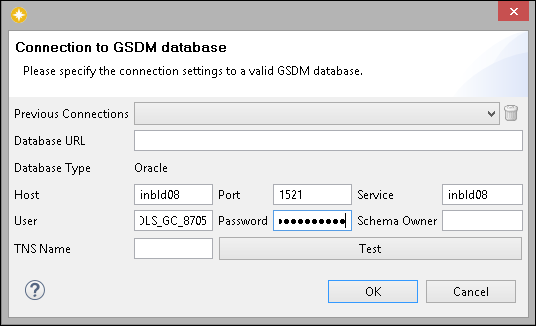
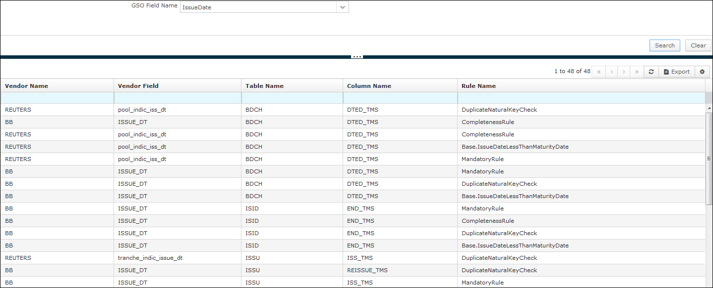
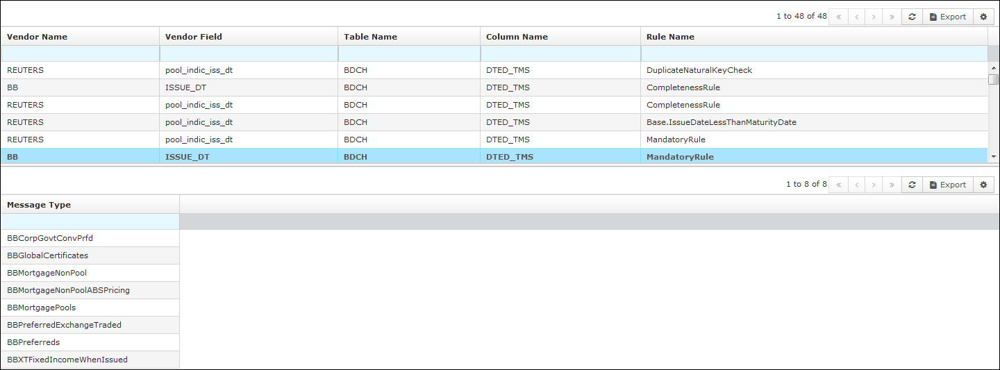

Overview - DataLineage
======================

This chapter describes how you can view the life cycle of data; starting from its origin to how it moves over a period of time. You can also learn about how data is processed as it undergoes diverse processes. Data Lineage helps you to analyze how information is used and track the key bits of information that serve a particular purpose.

Click . The product selection menu appears. Move the pointer over **DataLineage** and from the context menu, under **DataLineage**, you can access the following entity:

*   Traceability

Traceability
------------

Traceability is used to trace the life cycle of a vendor field in GoldenSource system. The system traces all the paths that the field could possibly take at any given condition. This section describes the fields displayed on the User Interface (UI) screens. The metadata is generated on the Traceability screen that helps the system to trace the data. The metadata which is required to trace the field to the screens on the Workstation UI is generated while building the screens. The required scripts are generated and the loadModel task is used to upload the data to the database. Follow the same process to develop the custom screens.

### Enabling Traceability

To enable traceability, you need to populate the FT\_T\_EMAP and FT\_BE\_BFVD tables. Perform the following steps to enable traceability:

1\. To populate the FT\_T\_EMAP table, click the  icon on the Mapping Designer perspective of workbench.

2\. Enter the connection details of the GSDM database in the metadata populator window and click **OK**.

3\. Populate the FT\_BE\_BFVD table using a starter set script for OOB GSO Business Fields. Contact GoldenSource Support team for this script.

3\. If there are any customized business fields, you need to make the corresponding entries in the FT\_T\_BFVD table from the **Vendor Mappings** tab of the GSO Designer. For more information, refer to the section, _Vendor Mappings_ in the chapter, _Working With GSO Editor_ of the GSO Designer Online Help guide.

4\. Restart the UI for the changes to be implemented.

Traceability search is used to perform the GSO Field Name search. To do so:

1.  Click . The products selection menu appears.
2.  Move the pointer over **Data Lineage** and from the context menu, select Traceability.
3.  The Traceability Search screen appears. Select the required GSO field for which you want to view the traceability details and click Search. The screen displays all the vendor names where that field is available.

> 

4.  Select the required entry. It displays another grid that shows you in which message type the selected vendor and vendor field are available.

> 
